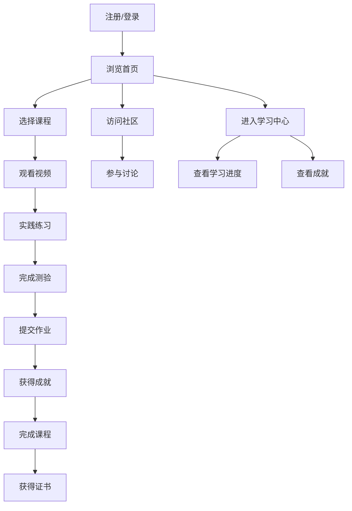

## 1. Product Overview
基于Python的数据分析在线教育平台，提供系统化的数据分析课程和实践环境。
- 解决用户学习数据分析技能的需求，提供从基础到高级的完整学习路径
- 目标用户包括学生、职场人士和数据爱好者，市场价值在于培养数据驱动决策能力

## 2. Core Features

### 2.1 User Roles
| Role | Registration Method | Core Permissions |
|------|---------------------|------------------|
| 普通用户 | 邮箱注册 | 浏览课程、观看视频、完成练习 |
| 付费用户 | 邮箱注册 + 付费 | 访问全部课程、下载资源、参与项目实践 |
| 讲师 | 邀请注册 | 发布课程、管理内容、查看学习数据 |

### 2.2 Feature Module
1. **首页**: 课程推荐、学习路径、最新动态
2. **课程页面**: 课程列表、详情、视频播放
3. **学习中心**: 个人学习进度、已完成课程、收藏内容
4. **实践环境**: Jupyter Notebook在线运行环境
5. **社区论坛**: 讨论区、问答、知识分享
6. **完整课程系统**: 课程管理、章节设置、内容管理
7. **互动式学习模块**: 实时互动、协作学习、讨论功能
8. **学习练习测评**: 在线练习、测验、作业提交
9. **成就激励系统**: 徽章、积分、排行榜

### 2.3 Page Details
| Page Name | Module Name | Feature description |
|-----------|-------------|---------------------|
| 首页 | 英雄区 | 平台介绍、主要功能展示、注册入口 |
| 首页 | 课程推荐 | 基于用户兴趣推荐相关课程 |
| 首页 | 学习路径 | 展示不同级别的学习路径和职业方向 |
| 课程页面 | 课程列表 | 分类展示所有课程，支持筛选和搜索 |
| 课程页面 | 课程详情 | 课程大纲、讲师信息、学员评价 |
| 课程页面 | 视频播放 | 高清视频播放、进度记录、笔记功能 |
| 学习中心 | 学习进度 | 可视化展示学习进度和完成情况 |
| 学习中心 | 已完成课程 | 展示已完成的课程和获得的证书 |
| 实践环境 | Jupyter环境 | 在线运行Python代码、数据可视化、保存结果 |
| 社区论坛 | 讨论区 | 按主题分类的讨论帖子、回复功能 |
| 社区论坛 | 问答区 | 提问、回答、最佳答案标记 |
| 课程系统 | 课程管理 | 课程创建、编辑、发布、下架 |
| 课程系统 | 章节设置 | 课程章节划分、内容组织、顺序调整 |
| 课程系统 | 内容管理 | 视频、文档、代码示例的上传和管理 |
| 互动学习 | 实时互动 | 课程内讨论、问答、讲师互动 |
| 互动学习 | 协作学习 | 小组项目、团队作业、 peer review |
| 学习练习 | 在线练习 | 编程练习、数据处理任务、案例分析 |
| 学习练习 | 测验 | 章节测验、期中期末考试、技能评估 |
| 学习练习 | 作业提交 | 作业上传、自动批改、人工评分 |
| 成就系统 | 徽章系统 | 完成特定任务获得徽章、成就展示 |
| 成就系统 | 积分系统 | 学习行为获得积分、积分兑换奖励 |
| 成就系统 | 排行榜 | 学习时长、完成课程、积分排名 |

## 3. Core Process
用户注册登录后，可以浏览课程目录，选择感兴趣的课程开始学习。学习过程中可以观看视频、阅读资料、在实践环境中运行代码。付费用户可以访问高级内容和参与项目实践。用户还可以在社区中提问和分享知识。系统会根据用户的学习行为给予积分和徽章奖励，并在排行榜上展示排名。

## 4. User Interface Design
### 4.1 Design Style
- 主色调: 深蓝色 (#1a365d) 和浅蓝色 (#4299e1)
- 辅助色: 橙色 (#ed8936) 用于强调和按钮
- 按钮样式: 圆角矩形，带有轻微的阴影效果
- 字体: 标题使用 Inter Bold，正文使用 Inter Regular
- 布局风格: 卡片式布局，顶部导航栏，响应式设计
- 图标风格: 线性图标，简洁现代

### 4.2 Page Design Overview
| Page Name | Module Name | UI Elements |
|-----------|-------------|-------------|
| 首页 | 英雄区 | 大型背景图片，渐变叠加，突出平台价值主张，包含注册按钮 |
| 首页 | 课程推荐 | 卡片式布局，每张卡片包含课程缩略图、标题、评分和难度 |
| 首页 | 学习路径 | 时间线风格，展示不同阶段的学习内容和目标 |
| 课程页面 | 课程列表 | 网格布局，支持筛选和排序，显示课程基本信息 |
| 课程页面 | 课程详情 | 顶部视频预览，下方课程大纲使用折叠面板，右侧讲师信息和评价 |
| 学习中心 | 学习进度 | 环形进度条，详细的学习统计数据，最近学习的课程 |
| 实践环境 | Jupyter环境 | 代码编辑器风格，顶部工具栏，侧边文件浏览器，底部控制台 |
| 社区论坛 | 讨论区 | 帖子列表，每个帖子包含标题、作者、回复数和最后更新时间 |
| 成就系统 | 徽章展示 | 网格布局，每个徽章带有解锁条件和获得时间 |
| 成就系统 | 排行榜 | 表格形式，显示用户排名、积分和完成课程数 |

### 4.3 Responsiveness
- 采用桌面优先设计，同时支持平板和移动设备
- 在小屏幕上自动调整布局，将多列布局转为单列
- 触摸设备优化，增大点击区域，支持滑动操作

### 4.4 3D Scene Guidance
- 不适用，本项目为教育平台，不需要3D场景