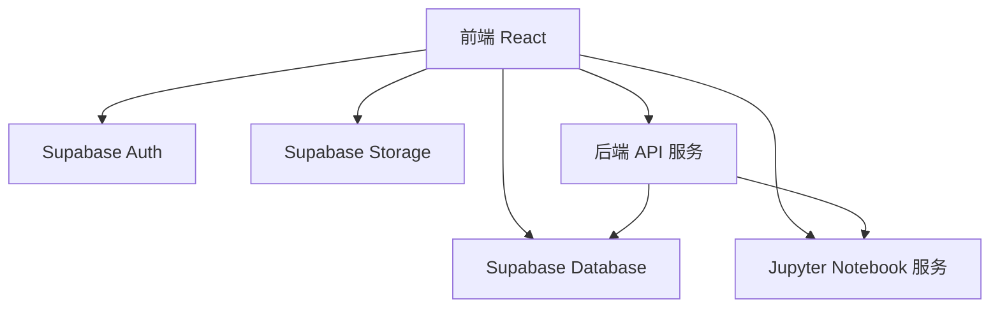
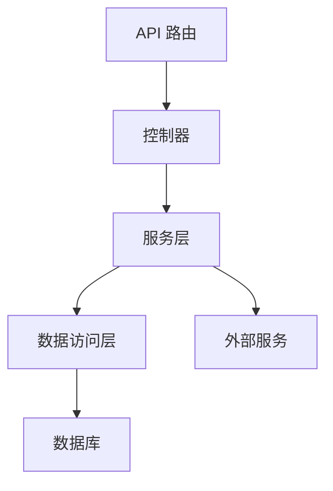
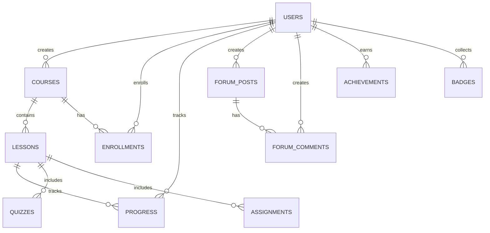

## 1. Architecture Design


## 2. Technology Description
- 前端: React@18 + TypeScript + Tailwind CSS + Vite
- 初始化工具: vite-init
- 后端: Express.js + TypeScript
- 数据库: Supabase (PostgreSQL)
- 存储: Supabase Storage
- 认证: Supabase Auth
- 在线编程环境: Jupyter Notebook + nbgrader
- 视频服务: 集成第三方视频平台或自建CDN
- 部署平台: Cloudflare Pages

## 3. Route Definitions
| Route | Purpose |
|-------|---------|
| / | 首页 |
| /courses | 课程列表页 |
| /courses/:id | 课程详情页 |
| /learning-center | 学习中心 |
| /practice | 实践环境 |
| /community | 社区论坛 |
| /profile | 个人资料 |
| /admin | 管理后台 |

## 4. API Definitions
### 4.1 课程相关 API
- GET /api/courses - 获取课程列表
- GET /api/courses/:id - 获取课程详情
- POST /api/courses - 创建课程（讲师）
- PUT /api/courses/:id - 更新课程（讲师）
- DELETE /api/courses/:id - 删除课程（讲师）

### 4.2 学习进度 API
- GET /api/progress - 获取个人学习进度
- POST /api/progress - 更新学习进度
- GET /api/certificates - 获取证书列表

### 4.3 社区 API
- GET /api/forums - 获取论坛帖子列表
- POST /api/forums - 创建帖子
- GET /api/forums/:id - 获取帖子详情
- POST /api/forums/:id/comments - 发表评论

### 4.4 实践环境 API
- POST /api/notebooks - 创建新的Notebook
- GET /api/notebooks/:id - 获取Notebook内容
- PUT /api/notebooks/:id - 更新Notebook
- POST /api/notebooks/:id/execute - 执行代码

### 4.5 成就系统 API
- GET /api/achievements - 获取个人成就
- GET /api/leaderboard - 获取排行榜
- POST /api/achievements/claim - 领取成就

## 5. Server Architecture Diagram


## 6. Data Model
### 6.1 Data Model Definition


### 6.2 Data Definition Language
```sql
-- 用户表
CREATE TABLE users (
  id UUID PRIMARY KEY REFERENCES auth.users(id),
  name TEXT NOT NULL,
  email TEXT NOT NULL UNIQUE,
  role TEXT DEFAULT 'user', -- user, premium, instructor, admin
  points INTEGER DEFAULT 0,
  created_at TIMESTAMP DEFAULT now()
);

-- 课程表
CREATE TABLE courses (
  id UUID PRIMARY KEY DEFAULT gen_random_uuid(),
  title TEXT NOT NULL,
  description TEXT,
  instructor_id UUID REFERENCES users(id),
  category TEXT,
  level TEXT, -- beginner, intermediate, advanced
  price NUMERIC DEFAULT 0,
  is_premium BOOLEAN DEFAULT false,
  created_at TIMESTAMP DEFAULT now()
);

-- 课时表
CREATE TABLE lessons (
  id UUID PRIMARY KEY DEFAULT gen_random_uuid(),
  course_id UUID REFERENCES courses(id),
  title TEXT NOT NULL,
  content TEXT,
  video_url TEXT,
  order_index INTEGER,
  created_at TIMESTAMP DEFAULT now()
);

-- 报名表
CREATE TABLE enrollments (
  id UUID PRIMARY KEY DEFAULT gen_random_uuid(),
  user_id UUID REFERENCES users(id),
  course_id UUID REFERENCES courses(id),
  enrolled_at TIMESTAMP DEFAULT now()
);

-- 学习进度表
CREATE TABLE progress (
  id UUID PRIMARY KEY DEFAULT gen_random_uuid(),
  user_id UUID REFERENCES users(id),
  lesson_id UUID REFERENCES lessons(id),
  completed BOOLEAN DEFAULT false,
  last_accessed TIMESTAMP DEFAULT now()
);

-- 测验表
CREATE TABLE quizzes (
  id UUID PRIMARY KEY DEFAULT gen_random_uuid(),
  lesson_id UUID REFERENCES lessons(id),
  title TEXT NOT NULL,
  questions JSONB,
  created_at TIMESTAMP DEFAULT now()
);

-- 作业表
CREATE TABLE assignments (
  id UUID PRIMARY KEY DEFAULT gen_random_uuid(),
  lesson_id UUID REFERENCES lessons(id),
  title TEXT NOT NULL,
  description TEXT,
  created_at TIMESTAMP DEFAULT now()
);

-- 作业提交表
CREATE TABLE submissions (
  id UUID PRIMARY KEY DEFAULT gen_random_uuid(),
  user_id UUID REFERENCES users(id),
  assignment_id UUID REFERENCES assignments(id),
  content TEXT,
  grade NUMERIC,
  submitted_at TIMESTAMP DEFAULT now()
);

-- 论坛帖子表
CREATE TABLE forum_posts (
  id UUID PRIMARY KEY DEFAULT gen_random_uuid(),
  user_id UUID REFERENCES users(id),
  title TEXT NOT NULL,
  content TEXT,
  category TEXT,
  created_at TIMESTAMP DEFAULT now(),
  updated_at TIMESTAMP DEFAULT now()
);

-- 论坛评论表
CREATE TABLE forum_comments (
  id UUID PRIMARY KEY DEFAULT gen_random_uuid(),
  post_id UUID REFERENCES forum_posts(id),
  user_id UUID REFERENCES users(id),
  content TEXT NOT NULL,
  created_at TIMESTAMP DEFAULT now()
);

-- 证书表
CREATE TABLE certificates (
  id UUID PRIMARY KEY DEFAULT gen_random_uuid(),
  user_id UUID REFERENCES users(id),
  course_id UUID REFERENCES courses(id),
  issued_at TIMESTAMP DEFAULT now(),
  certificate_url TEXT
);

-- 徽章表
CREATE TABLE badges (
  id UUID PRIMARY KEY DEFAULT gen_random_uuid(),
  name TEXT NOT NULL,
  description TEXT,
  icon_url TEXT,
  condition TEXT
);

-- 用户徽章表
CREATE TABLE user_badges (
  id UUID PRIMARY KEY DEFAULT gen_random_uuid(),
  user_id UUID REFERENCES users(id),
  badge_id UUID REFERENCES badges(id),
  earned_at TIMESTAMP DEFAULT now()
);

-- 授权
GRANT SELECT ON users, courses, lessons, forum_posts, forum_comments, badges TO anon;
GRANT ALL PRIVILEGES ON users, courses, lessons, enrollments, progress, quizzes, assignments, submissions, forum_posts, forum_comments, certificates, user_badges TO authenticated;
```

## 7. Cloudflare Pages 部署配置
### 7.1 前端部署
- 构建命令: `npm run build`
- 构建输出目录: `dist`
- 环境变量: 
  - VITE_SUPABASE_URL
  - VITE_SUPABASE_ANON_KEY

### 7.2 后端部署
- 使用 Cloudflare Workers 或 Functions
- 环境变量: 
  - SUPABASE_URL
  - SUPABASE_SERVICE_ROLE_KEY
  - JUPYTER_SERVER_URL

### 7.3 部署流程
1. 连接 GitHub 仓库
2. 配置构建参数
3. 部署到 Cloudflare Pages
4. 设置自定义域名（可选）